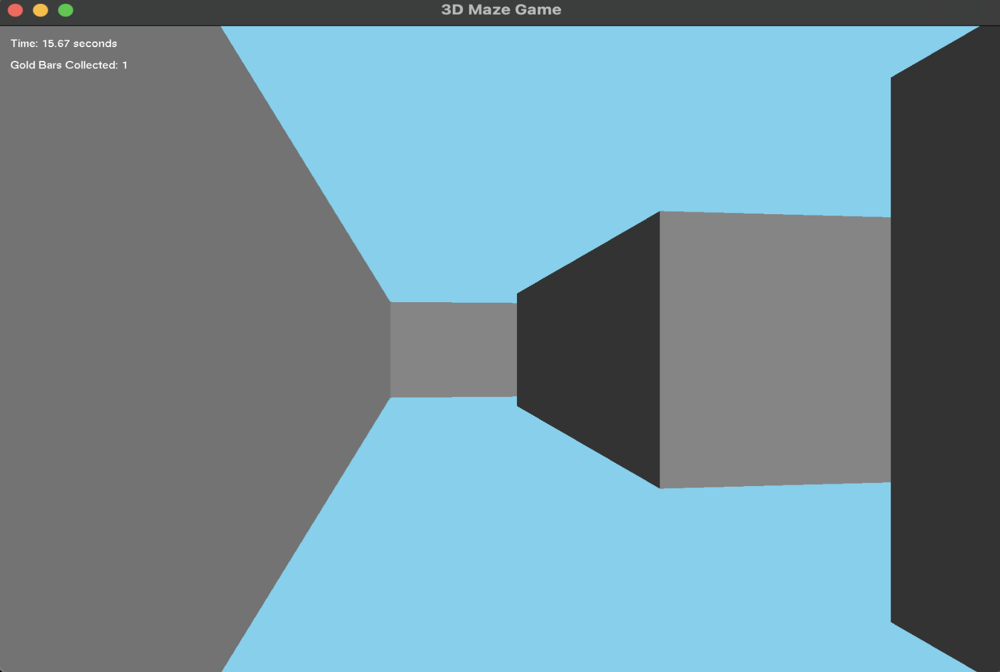
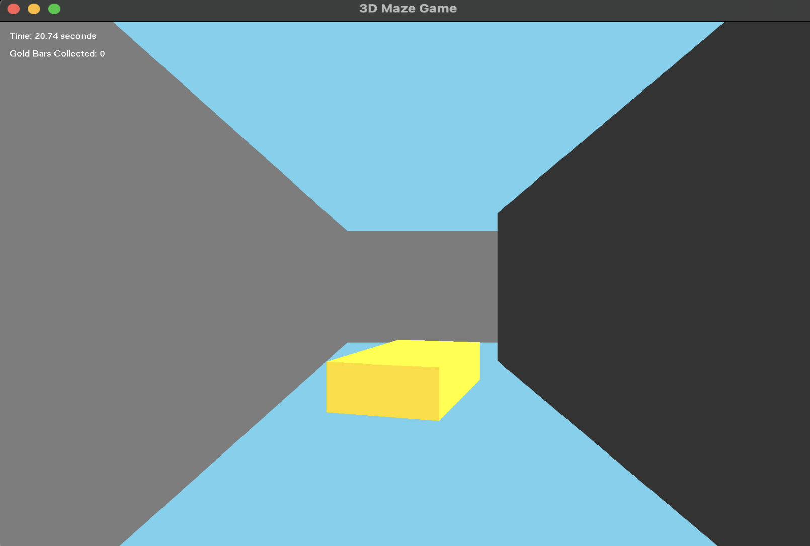
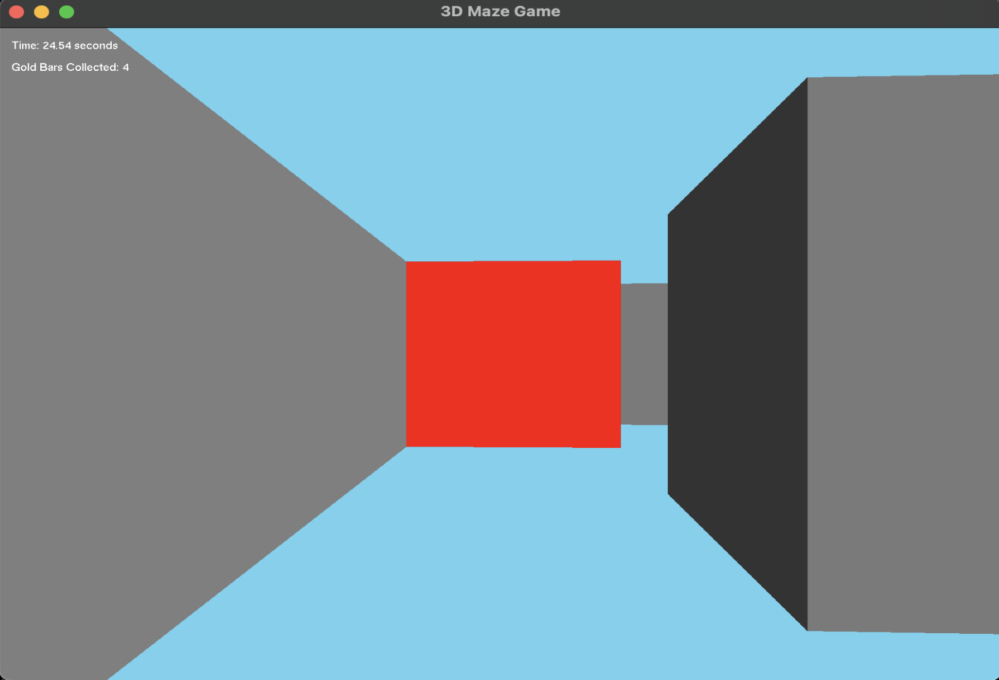
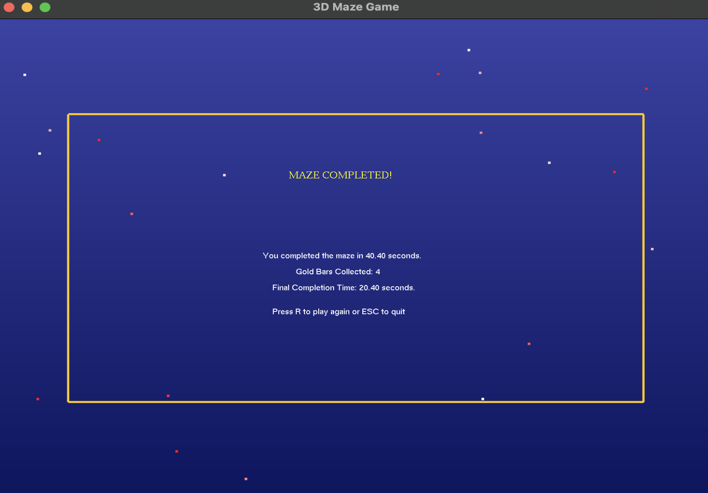

# 🧱 3D Maze Navigation Game

Welcome to **MAZE3D**, a fully interactive 3D maze game built using C++ and OpenGL (GLFW + GLUT). Navigate your way through a 3D maze, collect gold bars, and reach the red goal cube to complete the game. The game features dynamic lighting, floating collectibles, and a real-time timer with score tracking.

---

---

## ⚙️ Features

- First-person camera movement with smooth controls
- Simple 3D maze layout using a grid system
- Timer display using GLUT fonts
- Basic lighting and shading effects
- Red goal cube marks the end of the maze
- 🟡 **Collect Gold Bars**: Each gold bar reduces your total time by 5 seconds!
---

## 🖼 Gameplay Screenshots

- Maze


- Collectibles


- Goal


- Final Screen


---
## 🎥 Demo Video

📽 [Click here to watch the demo video](demo.mp4)

---
## 🛠️ Built With

- **Xcode** (macOS)
- **OpenGL** (`<OpenGL/gl.h>`)
- **GLUT** (`<GLUT/glut.h>`)
- **GLFW** (`<GLFW/glfw3.h>`)
- **C / C++**

---

## 🎮 How to Play

- **W** - Move Forward  
- **S** - Move Backward  
- **A** - Turn Left  
- **D** - Turn Right  
- **P** - Start the Game  
- **?** - View Rules (SHIFT + `/`)  
- **ESC** - Return to Main Menu or Exit  
- **R** - Restart after completion  
- **B** - Back to Main Menu

---

## 🚀 How to Run

1. Clone this repository or copy the files into a new Xcode project.
2. Link the following frameworks:
   - OpenGL.framework
   - GLUT.framework
3. Install GLFW if needed:
   ```bash
   brew install glfw

